# Customize calculation models

## Prerequisites

## Steps
### Add the supporting columns into the CDM and related view and form
0. Go to https://make.powerplatform.com
0. Navigate to `Dataverse` > `Tables`
0. Open the `Business Travel` table
    > If the table doesn't show up in the list, adjust the filter to `All` or `Custom`
0. Click on `Columns` under `Schema`
     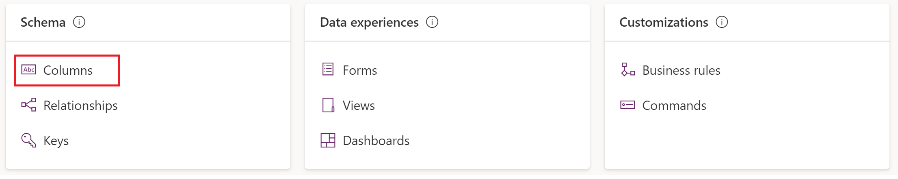
0. Add a new `Duration` column as following
  
 0. Add a new `Duration unit` column as following
  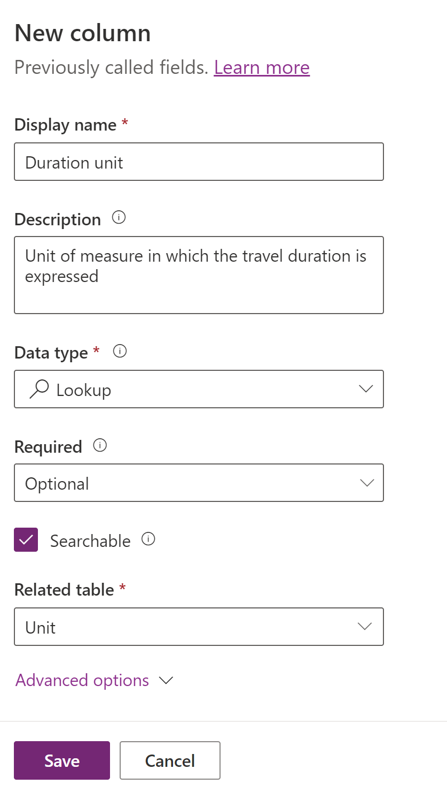
0. Go back to the `Business Travel` table and navigate to `Views`
         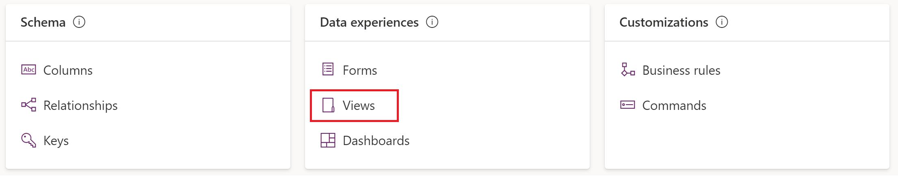
0. Select the `Business travels` view from the list
0. From the `Table columns` pane, drag and drop the `Duration` and `Duration unit` columns into the view
         
0. Click `Publish` to make the change to the view visible in Microsoft Sustainability Manager
0. In a new tab, open Microsoft Sustainability Manager. Navigate to `Data` > `Activity data`. At the right of `Business travel` (under Scope 3) click `View`. The grid should show the newly added columns `Duration` and `Duration unit`.
0. Go back to the Pawer Apps portal and back to the `Business Travel` table. Navigate to `Forms`
         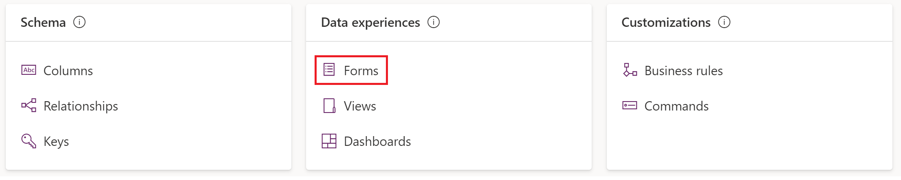
0. From the form list, navigate to the one with `Form type` = `Main`
0. Select the `Table columns` pane and drag and drop the `Duration` and `Duration unit` columns into the form (just below Night stay and Night stay unit)
         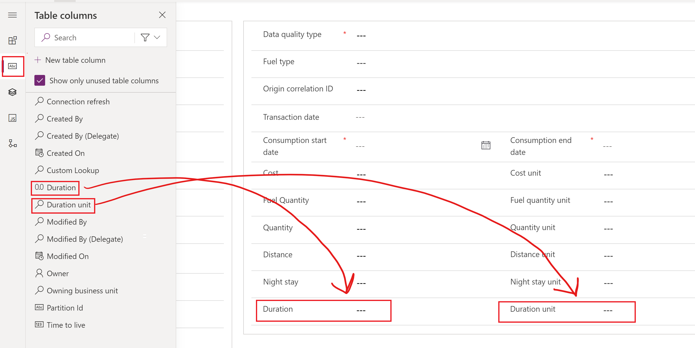
0. Click `Publish` to make the change to the form visible in Microsoft Sustainability Manager
0. Go back to Microsoft Sustainability Manager. From the `Business travel` view, click `New`. The form should show the newly added columns `Duration` and `Duration unit`.
0. Go back to the Pawer Apps portal and back to the `Business Travel` table. Navigate to `Forms`

### Add the reference data, emissions factor and emissions factor mapping required for the custom calculation model
#### Add the hour unit
0. In Microsoft Sustainability Manager navigate to `Settings` > `Unit groups`
0. Click `New`
0. Enter `Time` as Name. Leave all the other boxes blank and click `Save`.
         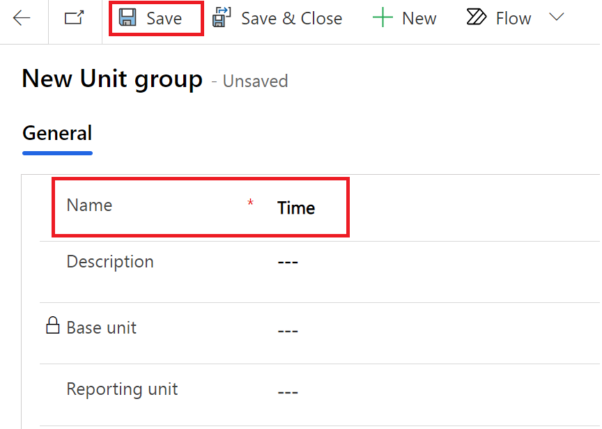
0. In the empty grid on the bottom of the Time unit group, click `New unit`
0. Enter `Hour` as Name. Leave all the other boxes blank and click `Save`.
         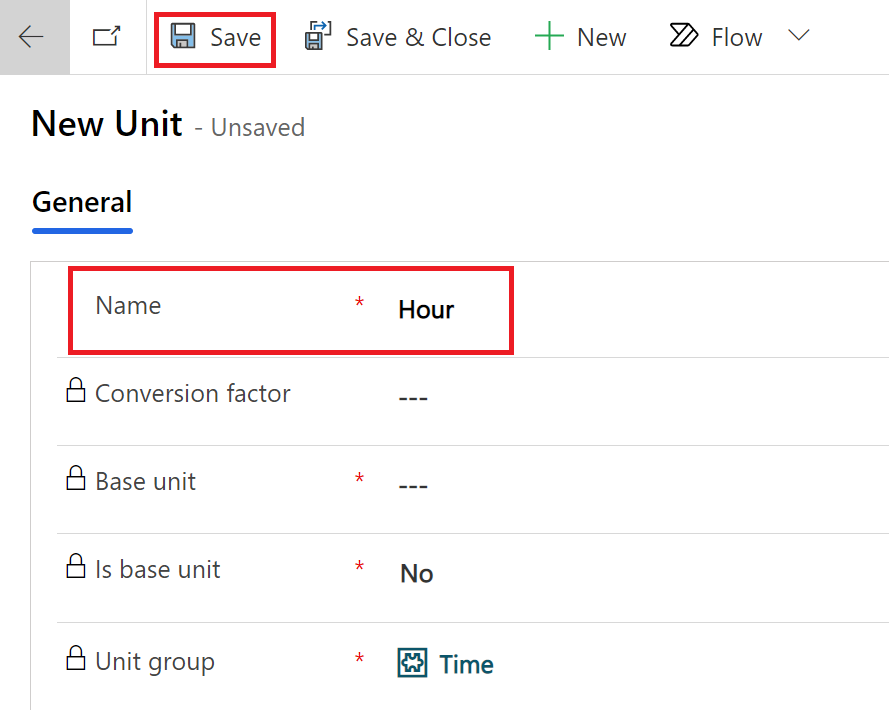
> Optionally, you can add derivate units in the Time group (such as second, minute, day) and define the conversion factors. But this is not required by this lab.
#### Add the Business Travel Type
0. In Microsoft Sustainability Manager navigate to `Settings` > `Reference data`
0. On the right of `Business travel types`  click `View`
0. Click `New`
0. Enter `Air travel - Contoso airlines` as `Name` and click `Save`
         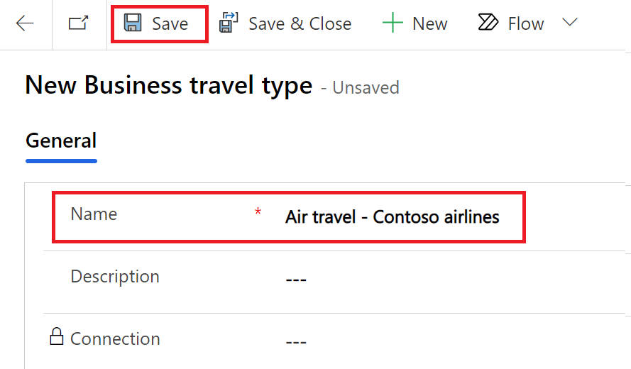
#### Add the Emission factor and related mapping
0. In Microsoft Sustainability Manager navigate to `Data` > `Factor libraries`
0. Click `Create new library`, name the library `My demo library`, set `Library type` as `Emission factor library` and click `Save`.
0. In the newly created _My demo library_ go to the `Emission factors` tab and click `New Emission factor`
         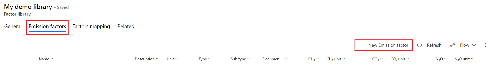
0. Enter the following data for the emission factor:
    - Name: `Air travel by duration`
    - Unit: `Hour`
    - CO₂: `70` Unit: `kg`
    - CH₄: `0.1` Unit: `g`
    - N₂O: `1.20` Unit: `g`
    - Do not enter any value for CO₂E as Microsoft Sustainability Manager will calculate that automatically using the GWP factors (which are visible and customizable in Settings)
    
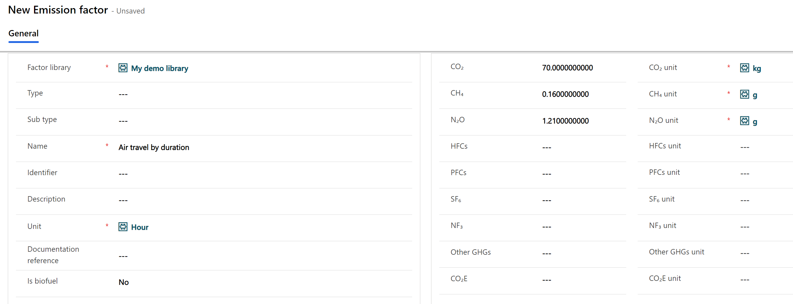

    
    > Notice that the conversions are for demo purpose only. It doesn't necessarily make sense to calculate air emissions by duration!
0. Click `Save` to save the emission factor and go back to _My demo library_
0. Go to the `Emission factors` tab and click `New Emission factor mapping`
0. As _Name_ enter `Air travel by duration - Contoso Airlines`
0. In _Reference data_ click on the search icon and then on `Advanced lookup`
         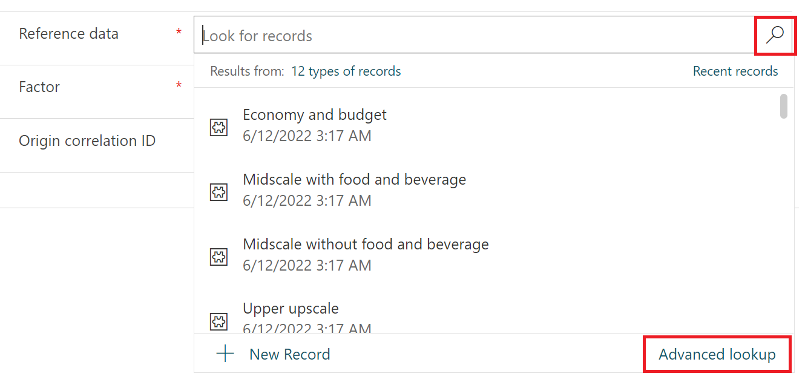
0. In the lookup dialog select `Business travel type` among the tables. Then select `Air travel - Contoso Airlines` from the list and click `Done`.
         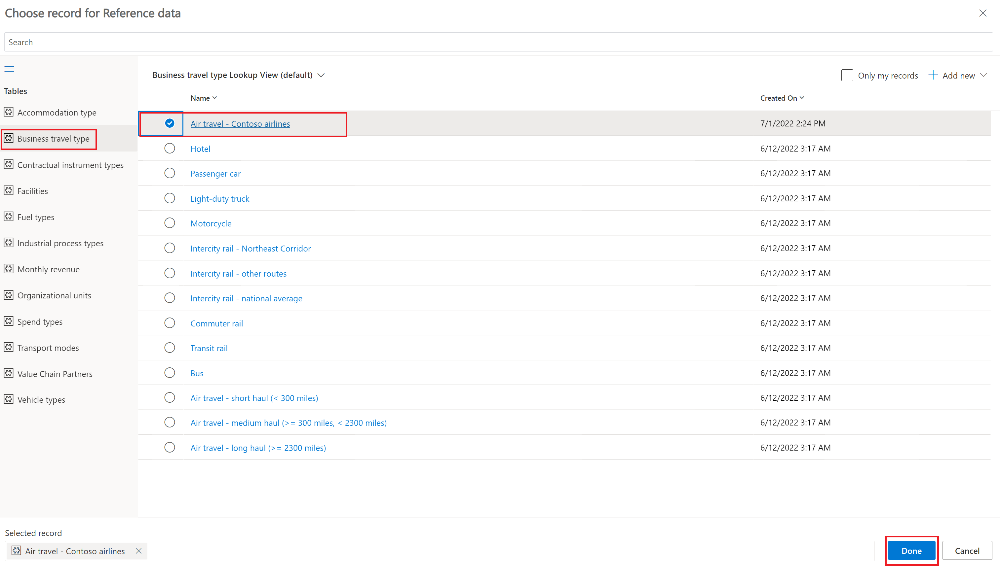
0. As _Factor_ select `Air travel by duration`
0. At this point the form should look like in the following picture:
         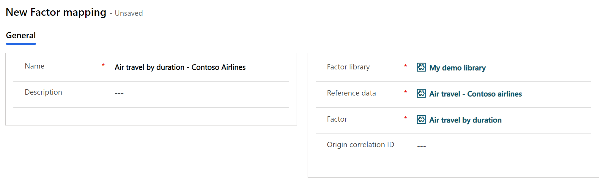
0. Click `Save` to save the emission factor mapping.

#### Create the custom calculation model
0. Navigate to `Data` > `Calculation models`
0. Click `New`
0. Enter the following data for the _Source node_:
    - Category name: `Business travel by duration`
        > This is the name that will be given to the calculation model
    - Activity data: select `Business travel` from teh list
        > This is the source table for the calculation model
    - Calculation method: `Travel duration * EF`
        > This is for description purpose only and it does not impact the calculation in any way
    - Documentation reference: `For demo purpose only`  
     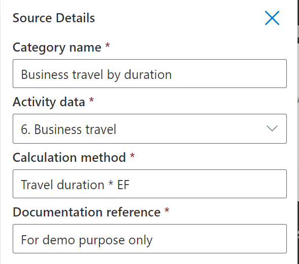
0. Under the source node click the `+` button to add a new node and `Report`
     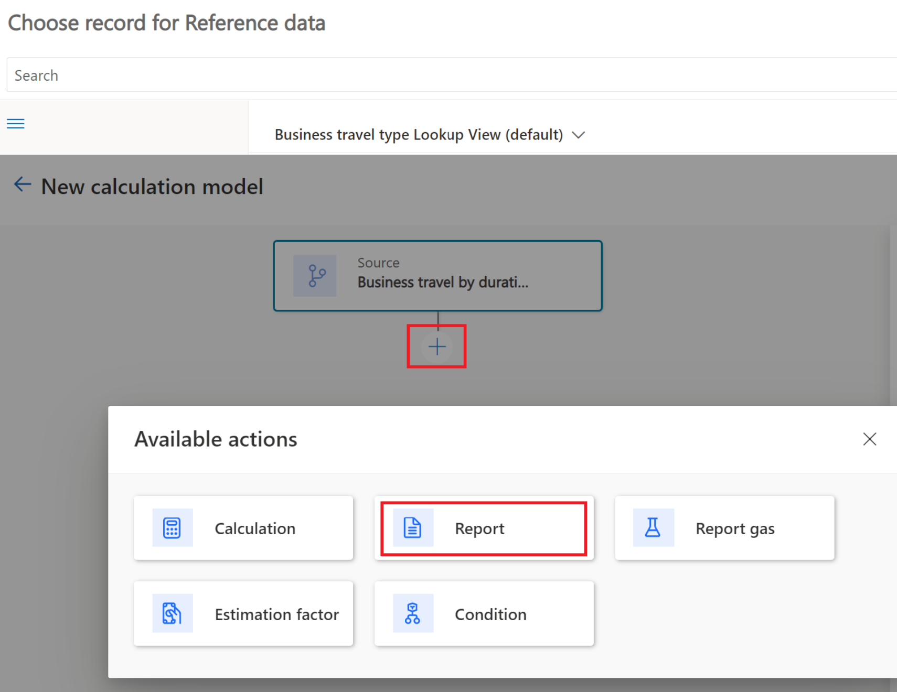
0. Enter the following data for the report node:
    - Category name: `Emissions from travel duration`
        > This will give a name to the node in the visual representation and is for description purpose only
    - Emission report value: select `Duration` from the list
        > This is the new column that we have added to the `Business travel` table earlier in this lab. The node will take the input value from there.
    - Unit: select `Duration unit` from the list
        > This is also a field we have added earlier. Instead of specifying a fixed unit such as `Hour` the calculation model will use the unit specified in the activity data and dynamically convert it if necessary.
    - Emission factor library: select `My demo library` from the list
    - Emission factor: select `Business travel type` from the `Emission factor mappings` list
        > Note that for the purpose of this lab we could even select the _emission factor_ `Air travel by duration`. But to make the calculation model more generic we are selecting an _emission factor mapping_ instead. This way we can reuse the same calculation model with multiple emission factors and mappings. For example we could add emission factors fro multiple aircraft or airlines or even extend it to ground transportation.

     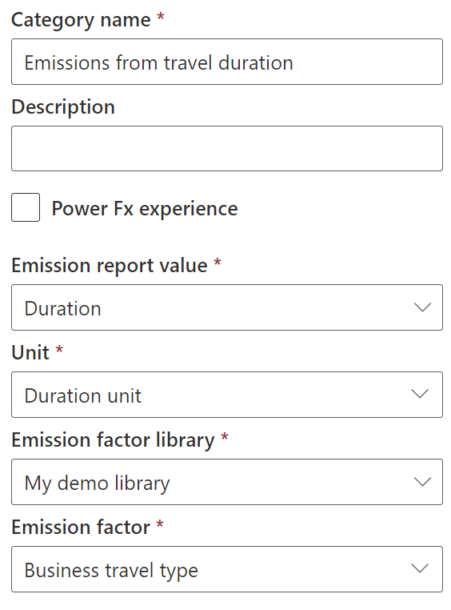
0. Click `Save` to save the calculation model

#### Add example data
0. Navigate to `Data` > `Activity data`. At the right of `Business travel` (under Scope 3) click `View`.
0. Click `New`
0. Enter the following data:
    - Name: `Flight from LHR to JFK`
    - Business travel type: select `Air travel - Contoso airlines` from the list
    - Organizational unit: `Contoso Corp`
    - Data quality type: `Actual`
    - Transaction date, Consumption start date, Consumption end date: enter the current date for all three
    - Duration: `12`
    - Duration unit: `Hour`

     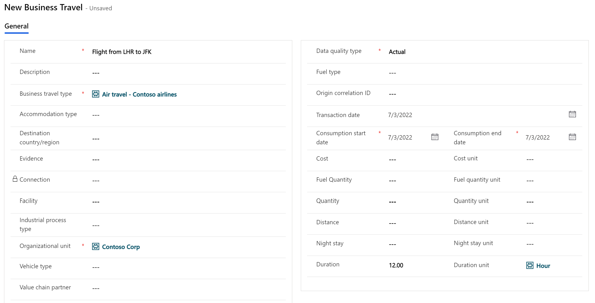
0. Click `Save`

#### Create the custom calculation profile
0. Navigate to `Data` > `Calculation profiles`
0. Click `New calculation profile`
0. In the _Create_ section enter the following information:
    - Calculation profile name: `Business travel by duration`
    - Emission source: select `Business travel` from the list
    - Activity data to include in calculation: add a new row filter with criteria `Business travel type` _Equals_ `Air travel - Contoso airlines`
        > This is important to avoid conflicts with the standard calculation model for Business Travels. We want to use our custom demo model only for specific _Business travel types_.
    - Calculation model: select `Business travel by duration` from teh list
        > This is the calculation model that we have just created
    - Schedule: make sure to check teh option _Automatically run this calculation when data is refreshed_

     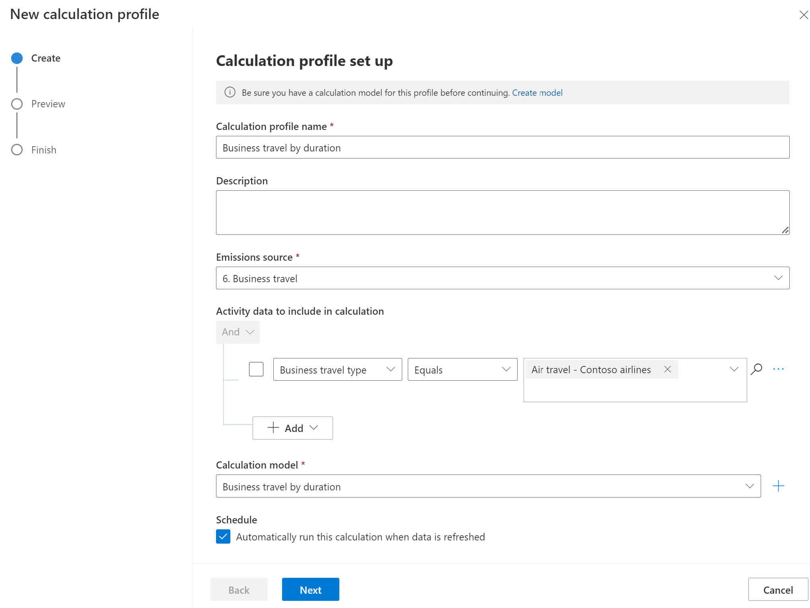

- Click `Next`. The emission calculation preview for the sample flight should appear. 
     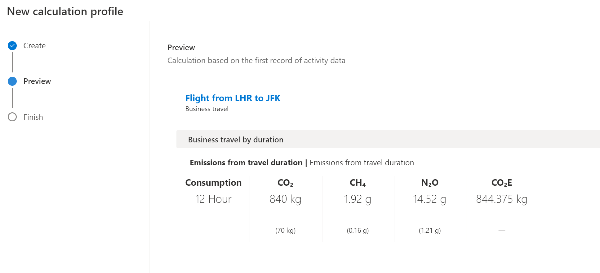
- Click `Save`

#### Run the calculation and observe the results
0. From the list of calculation profiles, select `Business travel by duration` and click `Run calculation`
     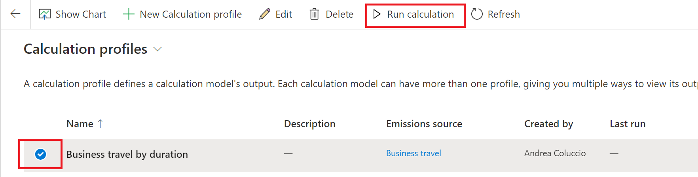
0. The status of the profile should show as `Executing` at first and then become `Successful` after a few seconds.
    > If the status doesn't update, click `Refresh` from teh toolbar
0. Navigate to `Analytics` > `All emissions`
0. Filter the list by `Activity type = Air travel - Contoso airlines`
0. One item should appear. Click on it to open the detailed form. You should see something similar to this:
     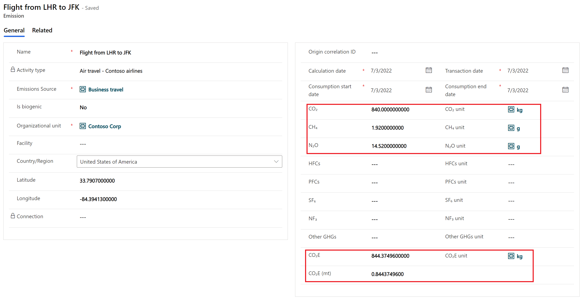
Notice that the greenhouse gasses have been calculated as per the custom calculation model and Microsoft Sustainability Manager has dynamically calculated the related CO₂E based on GWP factors.

#### Isolate the standard Business travel calculation model to avoid conflicts
0. Navigate to `Data` > `Calculation profiles`
0. Select `Business Travel Default Profile` and click `Edit`
0. Under `Activity data to include in this calculation` add the following row filter: `Business travel type` _Does not Equals_ `Air travel - Contoso Airlines`
     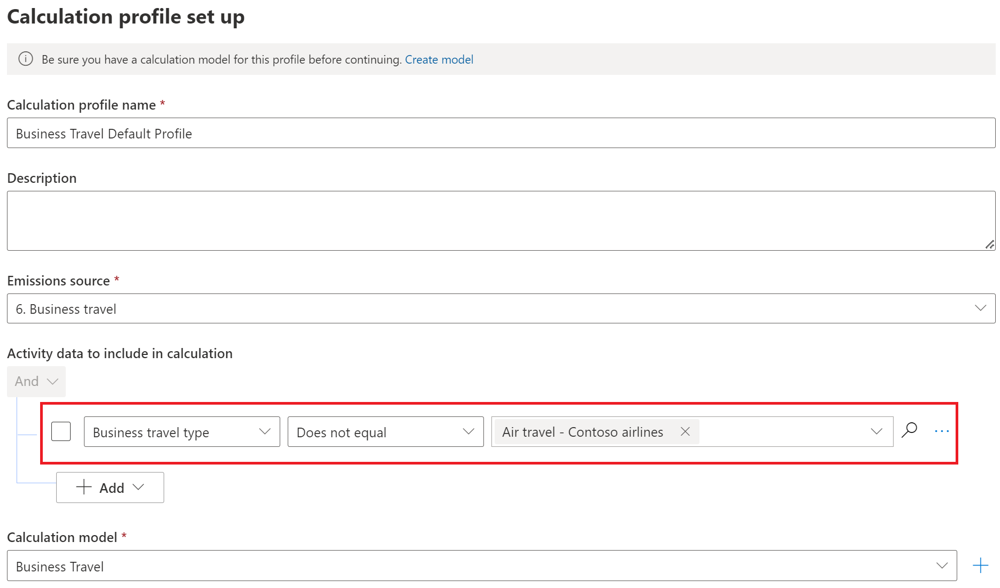
0. Click `Next` and `Save`

