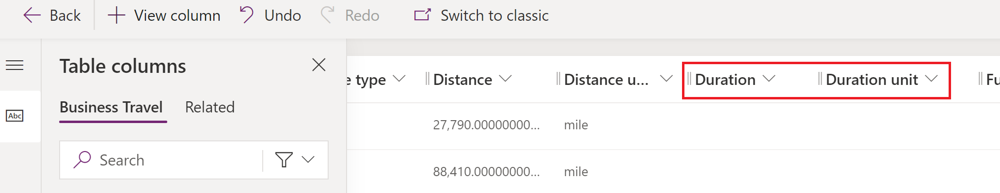

# Customize calculation models

## Prerequisites

## Steps
### Add the supporting columns into the CDM and related view and form
0. Go to https://make.powerplatform.com
0. Navigate to `Dataverse` > `Tables`
0. Open the `Business Travel` table
    > If the table doesn't show up in the list, adjust the filter to `All` or `Custom`
0. Click on `Columns` under `Schema`
     
0. Add a new `Duration` column as following
  
 0. Add a new `Duration unit` column as following
  
0. Go back to the `Business Travel` table and navigate to `Views`
         
0. Select the `Business travels` view from the list
0. From the `Table columns` pane, drag and drop the `Duration` and `Duration unit` columns into the view
         
0. Click `Publish` to make the change to the view visible in Microsoft Sustainability Manager
0. In a new tab, open Microsoft Sustainability Manager. Navigate to `Data` > `Activity data`. At the right of `Business travel` (under Scope 3) click `View`. The grid should show the newly added columns `Duration` and `Duration unit`.
0. Go back to the Pawer Apps portal and back to the `Business Travel` table. Navigate to `Forms`
         
0. From the form list, navigate to the one with `Form type` = `Main`
0. Select the `Table columns` pane and drag and drop the `Duration` and `Duration unit` columns into the form (just below Night stay and Night stay unit)
         
0. Click `Publish` to make the change to the form visible in Microsoft Sustainability Manager
0. Go back to Microsoft Sustainability Manager. From the `Business travel` view, click `New`. The form should show the newly added columns `Duration` and `Duration unit`.
0. Go back to the Pawer Apps portal and back to the `Business Travel` table. Navigate to `Forms`

### Add the reference data, emissions factor and emissions factor mapping required for the custom calculation model
#### Add the hour unit
0. In Microsoft Sustainability Manager navigate to `Settings` > `Unit groups`
0. Click `New`
0. Enter `Time` as Name. Leave all the other boxes blank and click `Save`.
         
0. In the empty grid on the bottom of the Time unit group, click `New unit`
0. Enter `Hour` as Name. Leave all the other boxes blank and click `Save`.
         
> Optionally, you can add derivate units in the Time group (such as second, minute, day) and define the conversion factors. But this is not required by this lab.
#### Add the Business Travel Type
0. In Microsoft Sustainability Manager navigate to `Settings` > `Reference data`
0. On the right of `Business travel types`  click `View`
0. Click `New`
0. Enter `Air travel - Contoso airlines` as `Name` and click `Save`
         
#### Add the Emission factor and related mapping
0. In Microsoft Sustainability Manager navigate to `Data` > `Factor libraries`
0. Click `Create new library`, name the library `My demo library`, set `Library type` as `Emission factor library` and click `Save`.
0. In the newly created _My demo library_ go to the `Emission factors` tab and click `New Emission factor`
         
0. Enter the following data for the emission factor:
    - Name: `Air travel by duration`
    - Unit: `Hour`
    - CO₂: `70` Unit: `kg`
    - CH₄: `0.16` Unit: `g`
    - N₂O: `1.21` Unit: `g`
    - Do not enter any value for CO₂E as Microsoft Sustainability Manager will calculate that automatically using the GWP factors (which are visible and customizable in Settings)
    

    
    > Notice that the conversions are for demo purpose only. It doesn't necessarily make sense to calculate air emissions by duration!
0. Click `Save` to save the emission factor and go back to _My demo library_
0. 