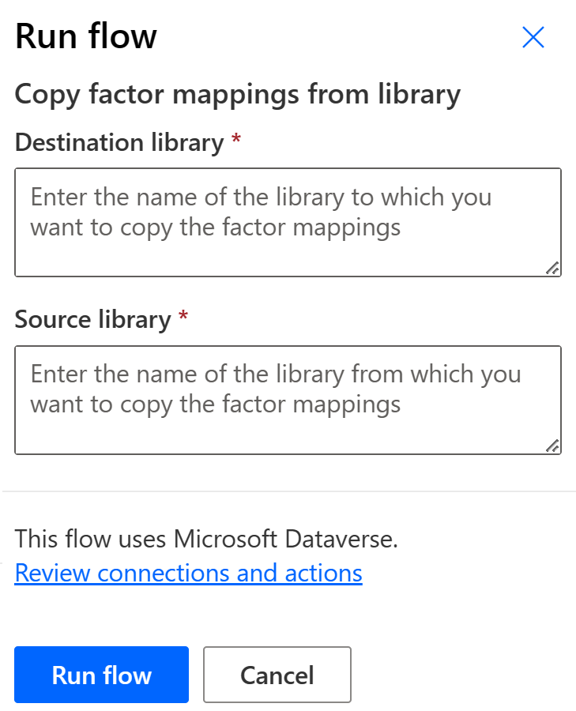

# Automating migration of factor mappings between libraries in Microsoft Sustainability Manager
## Scenario
Most emission factor libraries are updated periodically. In Microsoft Sustainability Manager, new versions of libraries typically appear as brand new libraries, with a reference to the year or version in the name.
Organizations using an old version of a library and wishing to switch to a new version are required to perform two actions:
1. Recreate all the mappings between factors and reference data in the new library.
2. Update the relevant calculation models to refer to the new library.

Depending on the number of emission factors included in the library and the number of mappings defined by the organization in the old version of the library, recreating the mapping might represent a tedious and labor-intensive task. This is particularly true if the versions of the libraries differ mostly in the GHG factor values rather than the names or granularity of the factors.

## Solution
This solution includes a Power Automate on-demand flow that automatically creates the factor mappings in a new library based on the factor mappings already existing in another library (typically an older version of the new library).

The flow requires two input parameters:
- `Source library` - The name of the library from which you want to copy the factor mappings.
- `Destination library` - The name of the library to which you want to copy the factor mappings.

The flow will look for factors in the destination library that name-match the factors in the source library and automatically recreate the mapping to reference data.

The flow is packaged as a Power Platform solution which you can import in a few easy steps:
1. [Download the packaged solution](Copyfactormappingstonewlibrary_1_0_0_1_managed.zip).
1. Go to https://make.powerapps.com and select your environment.
1. Navigate to `Solutions` and import the file you have downloaded on step 1.
1. Your environment will now include a flow named `Copy factor mappings from library` which you can run on demand.

You can also have a look at the [json code of the flow](Flow-Copyfactormappingsfromlibrary.json).

## Limitations
> Please make sure to read all the limitations below before using this solution!
- This solution can help automating the re-creation of mappings only for emission factors name-matching those in the source library. However, it is possible that new versions of libraries include new factors or that the names of some factors might change because of different granularity. You might still need to manually create additional mappings to address such cases.
- As part of factor mappings creation, the flow only supports the reference tables supported by Microsoft Sustainability Manager at the time of the creation of this solution. These include:
    - Accommodation types
    - Business travel types
    - Contractual instrument types
    - Disposal methods
    - Employee commuting types
    - Facilities
    - Facility types
    - Facility usage details
    - Fuel types
    - Industrial process types
    - Materials
    - Monthly revenues
    - Organizational units
    - Spend types
    - Transport modes
    - Vehicle types
    - Value Chain Partners
    - Accounts
    - Sustainability product identifiers (preview)
    - Sustainability product (preview)
- The flow only works for emission libraries. Estimation libraries are not currently supported (however, it is relatively easy to edit the flow to add support for it).
- Currently, the flow only performs inserts rather than upserts. This means that the flow will fail if it detects existing factor mappings in the destination library with the same name as those in the source library.
