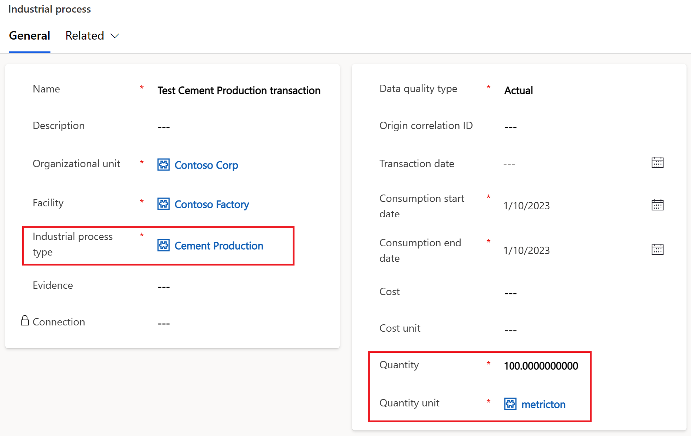

# Use Microsoft Sustainability Manager to calculate and report emissions from Industrial Processes
This article describes how to build an example calculation model and emission factor library to use  `Industrial Process` activity data to report the related carbon emissions. Given the high number of different types of industrial processes and the many methodologies to calculate emissions, Microsoft Sustainability Manager's approach to ingest, calculate and report on industrial processes is intentionally generic, flexible and customizable.

## Industrial Process Activity Data Table
The Sustainability Common Data Model (part of Microsoft Cloud for Sustainability) includes the `Industrial Process` entity. This is the table that Microsoft Sustainability Manager uses as an input to calculate industrial process emissions.
In addition to the columns that are common to all activity data entities (name, organizational unit, facility, data quality type, consumption start and end dates) the Industrial Process table includes three key columns:
- `Industrial process type` which identify to which industrial process the transaction refers (i.e. Cement Production or Chemical Process). This is important as the calculation engine will use this column to select the correct calculation model and emission factors to use in order to calculate the emissions.
- `Quantity`. The meaning of this column depends on the type of industrial process and on the calculation method. For example, an organization might decide to calculate their emissions from Cement Production based on the quantity of clinker used in the process. In that case, when `Industrial process type` = `Cement Production` than the `Quantity` column is assumed to refer to the quantity of clinker used.

 

Some organizations might require more complex calculation methods for their industrial process which might require multiple quantitative data for a single transaction. In such cases, organizations can either split transactions in multiple `Industrial process` records and use different `Industrial process type`s or extend the data model by adding additional columns to the `Industrial process` table. The additional columns can be used in calculation models within Microsoft Sustainability Manager

## Industrial process types Reference Data
The Sustainability Common Data Model also includes a reference table called `Industrial process types`. This table includes the items available in the `Industrial process type` column of the `Industrial Process` table.
The table comes preloaded with a few example industrial process types but organizations can add their owns.
 

## Example calculation for cement production
In this section we will describe a basic example of calculating emissions for cement production using Microsoft Sustainability Manager. The same approach can be used for any industrial process.

### Methodology
In this example we will calculate CO2 emissions based on the quantity of clinker used in the process. We will use the emission factor of 0.507 tons of CO2 per ton of clinker.

> ### DISCLAIMER
> The calculation methodology used in this article is intended as an example with the sole purpose of describing how to technically configure Microsoft Sustainability Manager to implement emission calculation for industrial processes. It does NOT constitute functional guidance on how to calculate emissions for cement production. The emission factors included in this article are not guaranteed to be accurate or current.

### Step 1 - Industrial process types
The first step would be adding the industrial process for which we want to calculate emissions to the `Industrial process types` table.
In our case, `Cement production` is already included out-of-the-box so we don't need to add it. Otherwise, we would go to `Settings` > `Reference data` > `Industrial process types` and add the name of our industrial process.

### Step 2 - Factor library
For the purpose of this demo, we will create a separate factor library to contain our emission factor and related mapping.
Depending on the scenario, organizations might decide to use an existing library instead.
To create a factor library go to `Data` > `Factor libraries` > `New Factor library`, give a name and make sure that the `Library type` is set to `Emission factor library`.
In this article we use a library named _Demo Industrial process factors_.
 

### Step 3 - Emission factor
Within the factor library we need to add our specific emission factor to convert a quantity of clinker into CO2 emissions.
From the factor library that we created in the previous step, we can go to the `Emission factors` tab and click `New emission factor` to create our factor.
> Note that emission factors can be also imported from various sources instead of being manually entered.

Key data to add to the emission factor record includes:
- `Name` - In this example we will use `Cement Production - Emissions from clinker`
- `Unit` - This is the unit of measure for the input quantity. In our case we want to define _X metric tons of CO2 per 1 metric tons of clinker_ therefore we will set `Unit` = `metricton`. As an example, if we wanted to define _X metric tons of CO2 per 1 kg of clinker_ than we would set `Unit` = `kg`.
    > Notice that the unit of measure in the emission factor does not necessarily need to coincide with the unit in which the activity data are entered or ingested. We could for example define the factor as _kg_ and then ingest industrial process activity data in metric tons, lb, and grams. Microsoft Sustainability Manager's calculation engine will automatically take care of the conversion for each activity data item.
- `CO2` and `CO2 unit` - This is where we define how much CO2 we emit for 1 ton of clinker. Our example is _0.507 metric ton of CO2 per metric ton of clinker_. Therefore we set `CO2` = `0.507` and `CO2 unit` = `metricton`.
    > In our example we only produce CO2 but other industrial processes might produce other or multiple greenhouse gasses. In that case we would add the quantities and units of each relevant greenhouse gas in the same emission factor.

### Step 4 - Emission factor mapping
Next we need to indicate in which conditions we want to use the emission factor that we created in the previous step. There are different ways to do that but in this article we will use the `Emission factor mapping` to link our emission factor to the `Industrial process type`.
In short, we want to instruct Microsoft Sustainability Manager to use our _Cement Production - Emissions from clinker_ emission factor to calculate items in the `Industrial process` table when `Industrial process type` = `Cement production`.
In order to do that, we go back to our factor library _Demo Industrial process factors_, we open the `Factors mapping` tab and we click on `New factor mapping`.
Key data to add to the emission factor mapping record includes:
- An arbitrary name
- `Reference data` section - Here we set the reference data to which our emission factor will be linked. Ultimately this sets the conditions in which the emission factor will be used by the calculation engine. We can define a combination of multiple reference data but in our example we simply select the `Cement production` item from the `Industrial process types` reference table.
- `Factor library` - the library that contains the emission factor we want to map. In our case that is `Demo Industrial process factors`.
- `Factor` - This is the emission factor we want to map. In our case that is `Cement Production - Emissions from clinker` which we created in step 3.

### Step 5 - Calculation model
Next we need to create the calculation model to actually define the emission calculation. In this example we we will leverage the power of the dynamic calculation engine included in Microsoft Sustainability Manager to create a generic model that can be used not only for cement production but for any industrial process.
> Some organizations might need more complex calculation models for some industrial processes and they might therefore need calculation models specific to processes. Such scenario is also supported and can be configured in a _default + exceptions_ approach. This is out of the scope of this article.

To create our calculation model we go to `Data` > `Calculation models` > `New`
In the root node of the model (the _Source_ node) we need to define:
- `Category name` - this will be the name of the calculation model itself. In our example we will name it `Industrial process by quantity`.
    > The name intentionally does not refer to cement production as the same model can be used for other industrial processes.
- `Activity data` - this defines the table that will be used as an input for the calculation. In our case we will select `Industrial process`.

Next we need to add a new calculation node by clicking the `+` icon below the root node and selecting `Report` among the available type of actions.

For the newly added _report_ node we need to define the following:
- `Category name` - An arbitrary name that will just appear in the visual design of the model.
- `Emission report value` this is the column of the source activity data table (in our case the _Industrial process_ table) from where the input value for the calculation action will be taken. We want to apply our emission factor to the values contained in the `Quantity` column of the `Industrial process table`. So we will select `Quantity`.
- `Unit` this will define the unit of measure for the input value. We can either select a static value (such as _kg_) or select the column in the source activity data table that will contain the unit of measure. In our case we have the `Quantity unit` column in the `Industrial process` table so that's what we will select.
- `Emission factor library` - This is the library that contains all the emission factors considered by this model. In our case we will select our `Demo Industrial Process Factors` library.
- `Emission factor` - Here we could statically select our _Cement Production - Emissions from clinker_ emission factor. But in that case the model would not be generic anymore and we would need to create a calculation model for each emission factor. Instead we just select the column of the source activity data that we want to be used by the calculation engine to dynamically determine the right emission factor based on mappings. In our case we select `Industrial process type`. The calculation engine will read that value for each industrial process record and select the right emission factor based on the defined emission factor mappings linked to the related reference data. When `Industrial process type` = `Cement production` then the calculation engine will select our _Cement Production - Emissions from clinker_ emission factor. For other Industrial process types the relevant factors will be selected (provided a mapping exist).
    > Using the `Add emission factor` button we could define a combination of columns to be used to determine the right factor. This is to address more complex scenarios.

Our calculation model is now complete and we can save it.

### Step 6 - Example activity data
To verify that the configuration we have implemented so far works, we need some example data in our Industrial Process table.
In most real-world scenarios, organizations would ingest data from external data sources rather than entering it manually. But for test purpose we will add a fictitious record by going to `Data` > `Activity data` > `Industrial process` > `View` and click `New`.
Example data:
- `Name` = `Test Cement Production transaction`
- `Organizational unit` = `Contoso Corp`
- `Facility` = `Contoso Factory`
- `Industrial process type` = `Cement Production`
- `Data quality type` = `Actual`
- `Consumption start date` = _current date_
- `Consumption end date` = _current date_
- `Quantity` = `10`
- `Quantity unit` = `metricton`
 

### Step 7 - Calculation profile
The calculation model in itself is just a definition. In order to actually execute a calculation we need a **calculation profile**. Let's create one to execute our industrial process calculation model.

1. Navigate to `Data` > `Calculation profiles`
0. Click `New calculation profile`
0. In the _Create_ section enter the following information:
    - Calculation profile name: `Industrial process`
    - Emission source: select `Industrial process` from the list
    - Calculation model: select `Industrial process by quantity` from the list
        > This is the calculation model that we have just created
    - Schedule: make sure to check the option _Automatically run this calculation when data is refreshed_

 

- Click `Next`. The emission calculation preview for the sample flight should appear. 
- Click `Save`

### Step 8 - Run the calculation and observe the results
We can now run our calculation profile and see the calculated emissions.
0. From the list of calculation profiles, select `Industrial process` and click `Run calculation`
0. The status of the profile should show as `Executing` at first and then become `Successful` after a few seconds.
    > If the status doesn't update, click `Refresh` from the toolbar
0. Navigate to `Analytics` > `All emissions`
0. Sort the list by _Calculation date_ descending or filter the list by `Activity type = Cement production` in order to find the newly calculated item.
0. Click on the relevant record to open the detailed form. You should see something similar to this:
 

After a while, the calculated data will be visible in the reporting, insights and scorecard features as in the example below:
 
