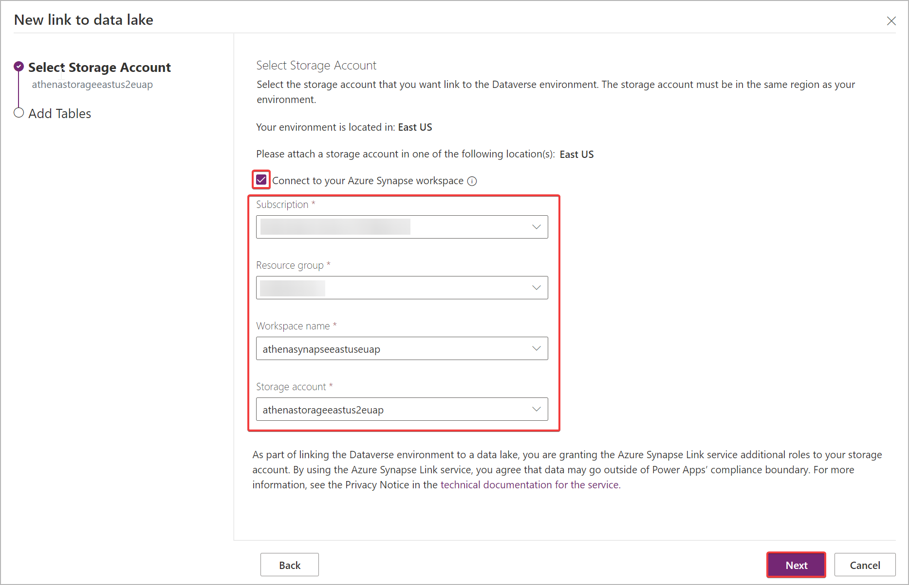

# Query MC4S data via Dataverse Synapse Link

## Prerequisites
- An Azure Subscription linked to the same tenant where your Microsoft Cloud for Sustainability environment is deployed.

## Steps
### Find out the Azure region in which your environment is deployed
1. Go to http://make.powerplatform.com
1. Make sure that you are in the right environment (check the `Environment` badge on the top right)
1. Click `Dataverse` > `Azure Synapse Link`
1. Click `New Link`
1. In the `Select storage account` tab, take note of the Azure region. This is the region in which you need to create the Synapse workspace

1. Click `Cancel`

### Create a Synapse Analytics Workspace
1. Follow [this guide](https://docs.microsoft.com/en-us/azure/synapse-analytics/get-started-create-workspace) to create a Synapse Analytics Workspace.
    > Make sure you create the workspace in the region identified earlier in this guide.
2. In the Azure Portal, navigate to the storage account you have created as part of the Synapse workspace creation
3. Navigate to `Access Control (IAM)`
4. Ensure that your user has `Storage Blob Data Owner` role. If not, click `Add` > `Add role assignment` and assign yourself the `Storage Blob Data Owner` role
    > This is an important step as having the `Owner` or `Contributor` role at resource level is not enough in order to query data from Synapse

### Prepare the Dataverse tables to be linked to Synapse
In order to be linked to Synapse, a dataverse table needs to have `tracking` enabled.
1. Go to https://make.powerapps.com
1. Navigate to `Dataverse` > `Tables`
1. Select `Managed` in the filter on the top right
1. Click on the `Emission` table
1. Click `Properties`
1. Expand `Advanced options`
1. Make sure `Track changes` is enabled
1. Click `Save`
1. Do steps 4 to 8 again for the following tables:
    - `Facility`
    - `Purchased energy`
    - `Fugitive emission`

### Create the Dataverse Synapse Link 
1. Navigate to `Dataverse` > `Azure Synapse Link`
1. Click `New Link`
1. make sure `Connect to your Azure Synapse workspace` is enabled and select the subscription, resource group, workspace and storage account.

1. Click next
1. Select the following tables:
    - `Emissions`
    - `Facilities`
    - `Purchased energy`
    - `Fugitive emission`
1. Click Save

> For more details please follow [this guide](https://docs.microsoft.com/en-us/power-apps/maker/data-platform/azure-synapse-link-synapse)

### Confirm that data have been linked to Synapse
1. Go to the Azure Portal, and select the desired Azure Synapse Link and select `Go to Azure Synapse Analytics workspace` from the top panel.
    > Alternatively you can open Synapse Studio directly at https://web.azuresynapse.net
1. Expand `Lake Databases`, select _dataverse-environmentName-organizationUniqueName_ and expand `Tables`.
All of the exported dataverse tables will be listed and available for analysis.
1. Click on the ellipses on the side of  `msdyn_emissions` > `New SQL Script` > `Select TOP 100 Rows`

2. Once the query script is generated, click `Run` and you should get the first 100 rows from the emissions table

    > If when you click `Run` you get an error stating that the content cannot be listed, please double check that you have the `Storage Blob Data Owner` role on the storage as described in the "Create a Synapse Analytics Workspace" section.

