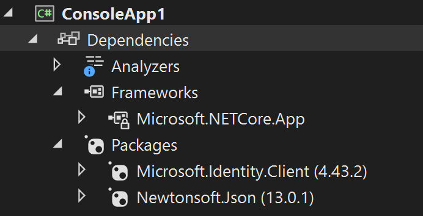

# Accessing MC4S data via Dataverse API with .NET 6 with Microsoft Authentication Library (MSAL)

## Steps
### Find the endpoint of your dataverse environment
1. Go to http://make.powerplatform.com
1. Make sure that you are in the right environment (check the `Environment` badge on the top right)
1. Click on the settings icon on the top right and select `Developer resources`.
    <br/>
1. Take note of the Web API endpoint (you will need this later in this lab). Copy only the part of the URL from "https:" through ".com" **leaving off the /api/data/v9.x**
    <br/>

### Create the AAD App Registration
In this step we will create the App registration (and underlying service principal) that your app will use to run the Azure Active Directory delegate authentication. In other words, we will need this to get the user authenticate with their credentials and use the resulting authentication token to access the dataverse.
1. Go to https://portal.azure.com
1. Navigate to `Azure Active Directory`
1. Navigate to `App registrations`
1. Click `New registration`
1. Fill in the form as following
    - Enter an arbitrary name (for example "my-mc4s-integrated-app")
    - As Supported account types leave it as single tenant
    - As Redirect URI, select `Public client/native (mobile & desktop)` and enter `http://localhost`
    
1. Click `Register`. The app registration will be created and you will be taken to its Overview tab
1. Take note of the `Application (client) ID` (you will need it later in this lab)
    
1. Navigate to `API permissions`, click `Add a permission`, select `APIs my organization uses`, type `dataverse` in the search box and select the `Dataverse` item from the list
    
1. Ensure the `user_impersonation` permission is checked and click `Add permission`
    
1. At this point you should see the user_impersonation permission in the permissions list
    
    > The last three steps are necessary to allow your app to impersonate the logged in user to access the MC4S data in the dataverse.

### Create a .NET 6 console app to query the emissions table
1. Open Visual Studio or Visual Studio Code and create a new .NET 6 Console App
2. Open the `Program.cs` file and replace the entire content with the following code:

    ```C#
    using MyMC4SApp;
    using Microsoft.Identity.Client;  // Microsoft Authentication Library (MSAL)
    using System.Net.Http.Headers;
    using System.Text.Json;

    namespace MyMC4SApp
    {
        class Program
        {
            static async Task Main()
            {
                // TODO Specify the Dataverse environment name to connect with.
                string resource = "Enter dataverse environment endpoint here";
                // TODO Specify the AAD app registration id.
                var clientId = "Enter App ID here";
                var redirectUri = "http://localhost"; // Loopback for the interactive login.

                #region Authentication

                var authBuilder = PublicClientApplicationBuilder.Create(clientId)
                                .WithAuthority(AadAuthorityAudience.AzureAdMultipleOrgs)
                                .WithRedirectUri(redirectUri)
                                .Build();
                var scope = resource + "/.default";
                string[] scopes = { scope };

                AuthenticationResult token =
                    authBuilder.AcquireTokenInteractive(scopes).ExecuteAsync().Result;
                #endregion Authentication

                #region Client configuration

                var client = new HttpClient
                {
                    // See https://docs.microsoft.com/powerapps/developer/data-platform/webapi/compose-http-requests-handle-errors#web-api-url-and-versions
                    BaseAddress = new Uri(resource + "/api/data/v9.2/"),
                    Timeout = new TimeSpan(0, 2, 0)    // Standard two minute timeout on web service calls.
                };

                // Default headers for each Web API call.
                // See https://docs.microsoft.com/powerapps/developer/data-platform/webapi/compose-http-requests-handle-errors#http-headers
                HttpRequestHeaders headers = client.DefaultRequestHeaders;
                headers.Authorization = new AuthenticationHeaderValue("Bearer", token.AccessToken);
                headers.Add("OData-MaxVersion", "4.0");
                headers.Add("OData-Version", "4.0");
                headers.Accept.Add(new MediaTypeWithQualityHeaderValue("application/json"));
                #endregion Client configuration

                #region Web API call

                var response = await client.GetAsync("msdyn_emissions?$top=10");

                if (response.IsSuccessStatusCode)
                {
                    using (var stream = response.Content.ReadAsStreamAsync())
                    {
                        var result = await JsonSerializer.DeserializeAsync<DataverseQueryResult<Emission>>(await stream)!;
                        await foreach (var emission in result!.value!)
                            Console.WriteLine($"{emission.msdyn_activityname} activity on {emission.msdyn_transactiondate} emitted {emission.msdyn_co2e} CO2 Equivalent");
                    }
                }
                else
                    Console.WriteLine($"Web API call failed with reason {response.ReasonPhrase}");
                #endregion Web API call

                Console.ReadKey();
            }
        }
        public class DataverseQueryResult<T>
        {
            public IAsyncEnumerable<T> value { get; set; }
        }
        public class Emission
        {
            public string? msdyn_activityname { get; set; }
            public DateTime msdyn_transactiondate { get; set; }
            public decimal msdyn_co2e { get; set; }
        }
    }
    ```
1. Replace the placeholder `Enter dataverse environment endpoint here` with the url retrieved earlier in this lab
1. Replace the placeholder `Enter App ID here` with the app registration id copied earlier in this lab
1. Add the following NuGet packages:
    - Microsoft.Identity.Client
    - Newtonsoft.Json
    <br/>
1. Run the console app
1. A browser window will be open to allow you to authenticate
1. After you authenticate, the console app should list the first 10 records of the Emissions table
    